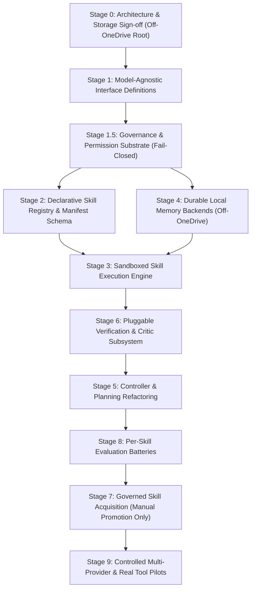

# NIRMAL-1 — AGI/ASI ARCHITECTURE DRAFT REVIEW
## Architectural Audit, Subsystem Consistency Analysis, and Governance Assessment

> **Classification**: REVIEW ONLY — NO IMPLEMENTATION AUTHORIZATION  
> **Target Document**: [`docs/NIRMAL_1_AGI_ARCHITECTURE_DRAFT.md`](file:///c:/Users/L.Thirumala%20Teja/OneDrive/Desktop/Nirmal%201/docs/NIRMAL_1_AGI_ARCHITECTURE_DRAFT.md)  
> **Review Date**: 2026-09-19  
> **Author**: Antigravity Autonomous Pair Programmer  
>
> ### Mandatory Governance Baselines
> - **Production State**: **STRICT NO-GO**
> - **Phase C Execution**: **NOT AUTHORIZED** (`PHASE_C_PREPARATION_BLOCKED`)
> - **Harness Recovery**: **HARNESS_RECOVERY_BLOCKED**
> - **Protected Tree Integrity**: `src/nirmal/` (23 files, 246,321 bytes) and `data/shards/` (18 files, 477,957 bytes) are **strictly immutable and unmodified**.
> - **Document Authority**: The architecture draft is a **design proposal only**; it does not authorize code changes, infrastructure provisioning, training runs, or benchmark executions.

---

## 1. Executive Summary

A comprehensive architectural review of [`docs/NIRMAL_1_AGI_ARCHITECTURE_DRAFT.md`](file:///c:/Users/L.Thirumala%20Teja/OneDrive/Desktop/Nirmal%201/docs/NIRMAL_1_AGI_ARCHITECTURE_DRAFT.md) was conducted against the physical state of the Nirmal-1 repository.

### Key Strengths
1. **Clear Paradigm Refocusing**: The draft correctly pivots Nirmal-1 from an undifferentiated next-token predictor to a **skill-centric, governed cognitive architecture** where skills are the discrete, versioned, and verified units of capability.
2. **Epistemic Honesty**: The draft preserves the repository's core tenet ("verification over confidence") and explicitly notes that autonomous self-improvement is **not implemented and not authorized**.
3. **Strict Research/Architecture Firewalls**: The draft explicitly isolates the V10.x associative-binding research track from the cognitive architecture track, reaffirming that V10.10 results do not constitute proof of AGI.
4. **Comprehensive Memory & Provenance Taxonomy**: The expansion into six distinct memory layers with an append-only, tamper-evident provenance log addresses the historical vulnerabilities identified during earlier provenance audits.

### Critical Deficiencies & Architectural Risks
1. **Hardcoded Subsystem Assumptions**: Existing code in `src/nirmal/agent/` (such as `procedural.py` strategy composition and `controller.py` model dispatch) contains hardcoded toy bindings ("X", "Y", "Z" subskills, direct `NirmalForCausalLM` imports) that directly conflict with the generalized abstraction proposed in the draft.
2. **OneDrive Storage Topology Vulnerability (RESOLVED)**: The proposed 300 GB store cannot reside within the working tree because the repository is synchronized via Microsoft OneDrive. This risk has been formally resolved by registering `D:\Nirmal-1-Store` as the designated external storage root, leaving the repository lightweight and protected.
3. **Absence of Sandboxing & Rollback Primitives**: The skill lifecycle lacks concrete rollback semantics and typed failure taxonomy. On Windows OS, non-trivial containerized isolation for code skills is unspecified.
4. **Accidental Coupling to Neural Bridge**: While claiming model-agnosticism, the draft retains reliance on internal model representations (hidden states, logit scoring) derived from `neural_bridge.py`, which are unavailable in standard external model provider APIs.

---

## 2. Architecture Consistency Audit (16 Proposed Subsystems)

Each of the 16 proposed subsystems was evaluated against the physical repository codebase:

| # | Subsystem | Classification | Detailed Repository Findings & Gap Analysis |
|---|---|---|---|
| **1** | **Core Intelligence (Orchestrator)** | `PARTIALLY PRESENT` | Present in [`src/nirmal/agent/controller.py`](file:///c:/Users/L.Thirumala%20Teja/OneDrive/Desktop/Nirmal%201/src/nirmal/agent/controller.py) as an 11-state deterministic state machine (`IDLE` $\to$ `OBSERVE` $\to$ `RETRIEVE` $\to$ `REASON` $\to$ `PLAN` $\to$ `ACT` $\to$ `VERIFY` $\to$ `UPDATE` $\to$ `LEARN` $\to$ `DONE`/`FAILED`). However, it directly instantiates `NirmalGenerator` and `NeuralBridge`, has no integration with a Skill Registry, and lacks automated governance gating. |
| **2** | **Reasoning Engine** | `PARTIALLY PRESENT` | Present in [`src/nirmal/reasoning.py`](file:///c:/Users/L.Thirumala%20Teja/OneDrive/Desktop/Nirmal%201/src/nirmal/reasoning.py) (`ReasoningEngine`, `ReasoningTrace`, `StepType`). Neural likelihood scoring exists in `neural_bridge.py`. Missing: structured counterfactual critique, model-agnostic prompting hooks, and provider-backed reasoning. |
| **3** | **Planning / Task Decomposition** | `PARTIALLY PRESENT` | Present in [`src/nirmal/planning.py`](file:///c:/Users/L.Thirumala%20Teja/OneDrive/Desktop/Nirmal%201/src/nirmal/planning.py) (`Planner`, `TaskGraph`, `PlanNode`). However, current plan nodes reference raw action strings, not versioned `SkillManifest` IDs (`skill_id@version`). Dynamic replanning exists but is primitive. |
| **4** | **Skill System (Runtime Executor)** | `MISSING` | No standalone runtime executor exists. Currently, actions are dispatched directly to `ToolRegistry` or executed as inline Python calls without sandboxing, memory read/write boundary enforcement, or timeout monitors. |
| **5** | **Skill Registry** | `MISSING` | No authoritative catalog, YAML/JSON manifest schema, semver resolver, capability indexer, or dependency graph resolver exists. The closest existing structure is an in-memory dictionary `ProceduralMemory.procedures`. |
| **6** | **Skill Acquisition / Learning** | `PARTIALLY PRESENT` / `REQUIRES FUTURE RESEARCH DECISION` | Strategy synthesis exists in [`src/nirmal/agent/learning_engine.py`](file:///c:/Users/L.Thirumala%20Teja/OneDrive/Desktop/Nirmal%201/src/nirmal/agent/learning_engine.py) (`synthesize_strategy_from_experience`), which extracts action sequences from successful episodes. However, automated translation into declarative skill manifests with AST anti-hardcoding checks is absent. Safe autonomous synthesis boundaries require fundamental research decisions. |
| **7** | **Skill Composition** | `PARTIALLY PRESENT` / `CONFLICTS WITH CURRENT DESIGN` | [`src/nirmal/agent/memory/procedural.py`](file:///c:/Users/L.Thirumala%20Teja/OneDrive/Desktop/Nirmal%201/src/nirmal/agent/memory/procedural.py) contains `compose_strategies()`, but it is **strictly hardcoded** to synthetic toy subskills ("X", "Y", "Z") using `string_util` and `mock_env`. The draft proposes generic DAG wiring with type-checked IO ports. The existing implementation is a synthetic mock and conflicts with the proposed generalized design. |
| **8** | **Memory System** | `PARTIALLY PRESENT` | In-memory representations exist for Working (`WorkingMemory`), Semantic (`SemanticMemory`), Episodic (`EpisodicMemory`), and Procedural (`ProceduralMemory`). Missing: Task memory and Provenance memory as formal subsystems. Crucially, **zero on-disk persistence backends** exist; all memory is lost when the Python process exits. |
| **9** | **Context Management** | `MISSING` | No bounded context packaging, token budgeting, dynamic memory eviction, or relevance-ranking subsystem exists. In the current controller, strings are naively concatenated into prompt templates. |
| **10** | **Tool / Environment Interface** | `PARTIALLY PRESENT` | Present in [`src/nirmal/tools.py`](file:///c:/Users/L.Thirumala%20Teja/OneDrive/Desktop/Nirmal%201/src/nirmal/tools.py) (`Tool`, `ToolResult`, `ToolRegistry`, and mock tools: `CalculatorTool`, `StringUtilityTool`, `MockEnvironmentTool`). Missing: OS-level sandboxing, external network/file access control, and runtime permission checks. |
| **11** | **Computer Control** | `MISSING` | Completely absent in the current repository. Only mock environment key-value mutations exist. No OS, filesystem, shell, or browser control tools are implemented. |
| **12** | **Verification / Critic System** | `PARTIALLY PRESENT` | Present in [`src/nirmal/agent/verification.py`](file:///c:/Users/L.Thirumala%20Teja/OneDrive/Desktop/Nirmal%201/src/nirmal/agent/verification.py) (`DeterministicVerifier` supporting predicate functions, numeric tolerances, and regex/exact matches). Missing: structural schema verifiers, isolated test-suite runners, formal provers, and adversarial calibration critics. |
| **13** | **Learning / Improvement Loop** | `PARTIALLY PRESENT` | Present in `learning_engine.py` (Bayesian Laplace reliability tracking, credit assignment across step sequences). Missing: periodic memory consolidation batch jobs ("sleep cycle") and proposal generation queues. |
| **14** | **Evaluation System** | `PARTIALLY PRESENT` | Behavioral evaluation suites exist in `evals/`, and scientific benchmark harnesses exist in `training/evaluation/`. Missing: dedicated per-skill regression batteries, permutation invariance checks, AST anti-leakage scanners, and automated promotion evidence gates. |
| **15** | **Governance / Permission System** | `MISSING` / `CONFLICTS WITH CURRENT DESIGN` | Currently, governance rules (protected paths, Phase C blocks, production NO-GO) exist solely as human instructions, markdown documentation, and test assertions. No runtime software interceptor gates operations or logs tamper-evident cryptographic authorization decisions. |
| **16** | **Model / Provider Layer** | `MISSING` / `CONFLICTS WITH CURRENT DESIGN` | Missing. The current agent architecture is tightly coupled to `NirmalForCausalLM` via `NirmalGenerator` and `NeuralBridge`. No abstract provider interface exists, directly conflicting with the draft's model-agnostic mandate. |

---

## 3. Skill System Lifecycle & Completeness Review

The proposed lifecycle:
$$\text{Discover} \longrightarrow \text{Select} \longrightarrow \text{Execute} \longrightarrow \text{Verify} \longrightarrow \text{Compose} \longrightarrow \text{Propose} \longrightarrow \text{Evaluate} \longrightarrow \text{Manually Gated Promote}$$

### 3.1 Structural Completeness Assessment
The high-level progression is logically sound and adheres to fail-closed principles. However, deep analysis reveals critical missing interfaces, edge cases, and circularities:

1. **Failure Taxonomy & Handling**:
   - The draft defines `SkillResult` with `value + evidence + resource usage`, but fails to define a structured error hierarchy.
   - *Requirement*: An explicit error enumeration is required: `TIMEOUT`, `PRECONDITION_FAILED`, `SANDBOX_VIOLATION`, `PERMISSION_DENIED`, `INTERNAL_EXCEPTION`, `VERIFICATION_FAILED`.
2. **Rollback & Compensation Semantics**:
   - The draft provides no mechanism for handling intermediate failures in composite skills. If Step 3 of a 5-step composite fails after Step 2 has mutated environment state, how is state restored?
   - *Requirement*: Skill manifests with `side_effects: "workspace" | "external"` must declare a `compensation_skill` or require transaction rollback semantics.
3. **Sandboxing on Windows OS**:
   - The manifest declares `sandbox: "restricted"`, but Windows lacks lightweight POSIX-style namespace isolation.
   - *Requirement*: The architecture must explicitly specify the sandboxing engine (e.g., Windows AppContainer, isolated Docker containers, or restricted Windows Job Objects with token filtering).
4. **Trust Demotion & Revocation**:
   - The lifecycle defines promotion: `proposed` $\to$ `evaluated` $\to$ `trusted`.
   - *Requirement*: It omits the reverse path: revocation/demotion (`trusted` $\to$ `quarantined` $\to$ `deprecated`) triggered when an eval battery regresses or a security flaw is detected.
5. **Potential Circular Dependencies**:
   - *Governance vs. Skills*: If governance checks are themselves implemented as inspectable rules or skills, a circular dependency arises where executing a governance skill requires a governance check. Governance policy enforcement must remain an independent, deterministic substrate beneath the skill system.
   - *Composition Recursion*: A composite skill could theoretically reference another composite that transitively references the first. The registry must enforce strict Directed Acyclic Graph (DAG) validation at registration time.

---

## 4. Memory Architecture Review (Six Logical Layers)

| Memory Layer | Persistence Scope | Verification Requirement | Retention Policy | Potential Conflict & Resolution Mechanism |
|---|---|---|---|---|
| **Working** | Session / RAM Only | None (Transient scratchpad) | Purged at goal termination; trace dumped to Episodic | *Conflict*: Scratchpad hypotheses may contradict established facts.  <br>*Resolution*: Working memory is strictly unverified; hypotheses never propagate to Semantic store. |
| **Episodic** | Persistent (Append-only JSONL) | Verifier verdicts attached; raw trajectory unverified | Rolling window + consolidation; superseded records archived | *Conflict*: Failed trajectories record incorrect actions.  <br>*Resolution*: Retains historical truth of what occurred; learning engine filters on `success == True` and verifier score. |
| **Semantic** | Persistent (Versioned KV / Triple Store) | **Mandatory 100% Verification**; unverified writes strictly barred | Indefinite; superseded facts marked `is_outdated` with version pointer | *Conflict*: New verified observation contradicts existing semantic fact.  <br>*Resolution*: Contradiction resolution marks old fact `is_outdated=True` and archives it in version chain; never overwrites in place. |
| **Procedural** | Persistent (Git-tracked YAML / Manifests) | Mandatory promotion battery + human gate | Immutable semver versions; deprecation flags only | *Conflict*: A skill is updated while active tasks rely on prior behavior.  <br>*Resolution*: Tasks must pin exact semantic versions (`id@major.minor.patch`). |
| **Task** | Session-scoped (JSON state) | Plan nodes must resolve to active skill IDs | Completed plans compacted into Episodic; active state discarded on reset | *Conflict*: Replanning loop enters infinite recursion on recurring failure.  <br>*Resolution*: Hard cap on `max_replan_attempts` (currently 3 in `controller.py`); emits task failure on exhaustion. |
| **Provenance** | Persistent (Hash-chained, append-only log) | Self-describing SHA-256 payload integrity | **Permanent; zero deletions, zero rewrites** | *Conflict*: None possible; append-only sink with no mutation operations. |

---

## 5. Model / Provider Independence Review

### 5.1 Verification of Decoupling
The draft establishes proper conceptual boundaries between:
- Model Identity (cryptographic hashes of weights and tokenizers)
- Provider Backend (runtime lifecycle and process management)
- Inference Interface (token generation and embeddings)
- Capability Metadata (empirically measured context length, tool syntax support)

### 5.2 Latent Coupling to `NirmalForCausalLM`
Despite its stated goal, the draft exhibits subtle architectural coupling to the repository's internal model:
1. **Neural Bridge Presumption**: §6 states that `neural_bridge.py` will serve as the reference implementation of the Reasoning Interface. However, `NeuralBridge` directly reads hidden states, layer activations, and perplexity across arbitrary token spans. Remote API providers (OpenAI, Anthropic, Google Vertex) do not expose internal residual streams or token-level loss gradients.
2. **Tokenizer Dependency**: The Context Manager assumes direct tokenizer access for context budgeting. External providers often use proprietary, server-side tokenizers without open local tokenizers.
3. **Candidate C Gravitational Pull**: Sizing discussions in §1.1 and §7 constantly benchmark against the 48.3 GB Candidate C checkpoint. The architecture must explicitly treat Candidate C as an unverified local provider implementation, not an architectural anchor.

---

## 6. Storage Topology & 300 GB Plan Review

### 6.1 Data Categorization Matrix

| Data Classification | Storage Location | Version Control | Immutability / Retention |
|---|---|---|---|
| **Skill Manifests & Bodies** | `skills/` | **Git-tracked** | Immutable semver; permanent history |
| **Frozen Benchmarks** | `evaluation/benchmarks/` | **Git-tracked** | **Immutable**; hash-locked |
| **Run Configurations** | `training/configs/` | **Git-tracked** | Permanent |
| **Model Weights & Shards** | `models/weights/` | External Object Store / Git LFS | Immutable per identity |
| **Active Checkpoints** | `models/checkpoints/` | Local-only (Not in Git) | Rolling last-N + milestones; pruned |
| **Full Datasets (200B tokens)** | Cluster Storage (External) | External Manifest Git-tracked | Retained on cluster |
| **Dataset Subsets / Pilots** | `datasets/` | Local-only | Retained while study active |
| **Persistent Memory Stores** | `memory/` | Local-only (Schema in Git) | Append-only / consolidated |
| **Forensic Provenance Log** | `forensic/` | Local-only + Git Hash Anchors | **Permanent, tamper-evident, append-only** |
| **Backups** | `backups/` | Local-only / Offsite | Periodic rolling snapshots |
| **Scratch Workspaces** | `scratch/`, `artifacts/` | Local-only (Gitignored) | **Disposable**; TTL auto-purge |

### 6.2 Storage Topology Resolution: Registration of D:\Nirmal-1-Store
The repository working directory currently resides at:
`c:\Users\L.Thirumala Teja\OneDrive\Desktop\Nirmal 1`

> [!CAUTION]
> **Prior Risk of OneDrive Sync Failure & Data Corruption (RESOLVED)**:
> 1. **Database Lock Contention**: Persistent memory engines (SQLite WAL, LMDB) open continuous file locks. OneDrive repeatedly attempts to upload locked files, resulting in sync conflicts, `.sync` duplicate files, and fatal database locking errors.
> 2. **Checkpoint Bandwidth Exhaustion**: Saving 48 GB model checkpoints or bursty optimizer states into OneDrive will trigger massive continuous background uploads, exhausting local network bandwidth and crashing the OneDrive client.
> 3. **Forensic Log Desynchronization**: High-frequency append-only JSONL writes will trigger file-access race conditions between the Nirmal execution runtime and the OneDrive sync engine.

**Design Decision & Registration Update**:
To eliminate OneDrive synchronization hazards, the external storage root has been formally registered as:
`D:\Nirmal-1-Store`

The repository remains at:
`C:\Users\L.Thirumala Teja\OneDrive\Desktop\Nirmal 1`

Existing registered subdirectories at `D:\Nirmal-1-Store`:
- `models\` — Model identities, safetensors weights, tokenizers, checkpoints
- `datasets\` — Raw, processed, tokenized shards, local dataset subsets
- `skills\` — Skill registry manifests, executables, dependency indexes
- `memory\` — Persistent backends (episodic JSONL, semantic store, embeddings)
- `training\` — Run configurations, training metrics, execution logs
- `experiments\` — Experimental study results, outputs, evaluations
- `evaluation\` — Frozen benchmarks, test batteries, evaluation reports
- `artifacts\` — Runtime scratch artifacts, tool outputs, sandbox runs
- `forensic\` — Tamper-evident hash-chained provenance logs, decision logs
- `backups\` — Scheduled snapshots of memory, skills, and audit logs
- `scratch\` — Disposable temporary working directory

**Governance Constraint**: This update is **documentation-only**. No files have been moved or copied. No training or Phase C operations are authorized. All protected paths (`src/nirmal/`, `data/shards/`) remain 100% intact.

---

## 7. Research vs. Production Separation & Safety Language Audit

### 7.1 Separation Verification
- The draft correctly maintains the firewall between V10.x research and the cognitive architecture.
- V10.10 is explicitly classified as an experimental study in associative binding, not proof of general intelligence.
- Production is explicitly marked **STRICT NO-GO**.
- Phase C is explicitly marked **NOT AUTHORIZED** (`PHASE_C_PREPARATION_BLOCKED`).

### 7.2 Statements Flagged for Potential Misinterpretation
To prevent accidental authorization creep, the following phrases in [`docs/NIRMAL_1_AGI_ARCHITECTURE_DRAFT.md`](file:///c:/Users/L.Thirumala%20Teja/OneDrive/Desktop/Nirmal%201/docs/NIRMAL_1_AGI_ARCHITECTURE_DRAFT.md) must be strictly construed as non-executable planning language:
1. **Section 11 Header ("Implementation Roadmap")**:
   - *Risk*: A reader might treat Stage 1 ("Core interfaces") as authorized for immediate coding.
   - *Clarification*: Line 497 ("execution of any stage is NOT authorized by this document") must govern all stages.
2. **Section 7 ("300 GB Dedicated Storage Plan")**:
   - *Risk*: Could be interpreted as an authorization to create directory structures or download weights.
   - *Clarification*: Line 427 ("No files are moved by this document") confirms this is a design schema only.
3. **Section 3.11 ("Computer Control")**:
   - *Risk*: Mention of "filesystem/process/browser control" could invite early prototyping.
   - *Clarification*: Must remain classified as a blocked, high-risk future capability requiring explicit human governance grants.

---

## 8. Implementation Roadmap Audit (Stages 0–9)

| Stage | Focus Area | Mandatory Prerequisite | Concrete Deliverables | Verification Requirement | Governance Gate | Review Platform |
|---|---|---|---|---|---|---|
| **0** | **Architecture Baseline** | None | Approved Review Report (`docs/NIRMAL_1_AGI_ARCHITECTURE_REVIEW.md`) | Peer review agreement on interfaces and storage location | Owner sign-off | GitLab + ChatGPT |
| **1** | **Core Interfaces** | Stage 0 approval | Abstract Python base classes: `SkillManifest`, `Provider`, `MemoryStore`, `GovernanceEngine` | Type-check validation (`mypy`), zero behavior change in existing codebase | Code review approval; zero protected-path edits | Antigravity / GitLab |
| **2** | **Skill Registry** | Stage 1 interfaces | Schema validator, semver resolution engine, `skills/` catalog loader | 100% round-trip serialization and dependency closure unit tests | Fail-closed registry tests passing | Antigravity / GitLab |
| **3** | **Skill Execution Engine** | Stage 2 registry | Sandboxed skill runtime, timeout monitors, tool permission interceptors | Mock-tool execution inside sandbox; constraint violations trapped cleanly | Security sandbox audit | GitLab + ChatGPT |
| **4** | **Persistent Memory** | Stage 1 interfaces | SQLite/JSONL backends for Episodic, Semantic, Procedural, and Provenance layers | Durability test (process kill/restart recovery), contradiction archival test | Data boundary & privacy audit | Antigravity / GitLab |
| **5** | **Planner & Orchestrator Integration** | Stages 3, 4 | Updated `CognitiveController` and `Planner` dispatching through Skill Registry | Full regression pass on existing behavioral evals (`evals/`) | Behavioral parity gate | Antigravity / GitLab |
| **6** | **Verification / Critic Subsystem** | Stage 5 integration | Pluggable verifier registry (structural, predicate, test-suite runners) | Symmetric falsification tests; synthetic injection of invalid results | Verifier calibration gate | GitLab + ChatGPT |
| **7** | **Skill Acquisition Pipeline** | Stage 6 verifier | Trajectory-to-proposal generator; manual promotion workflow tools | Generated skills restricted to `proposed`; zero auto-promotions | Human promotion policy gate | GitLab + ChatGPT |
| **8** | **Comprehensive Evaluation** | Stage 7 acquisition | Per-skill test batteries, anti-leakage scanners, frozen benchmark integration | Zero leakage detected; ablation baselines computed | Scientific validity audit | GitLab + ChatGPT |
| **9** | **Controlled Scaling & Real Tools** | All prior stages | Sandboxed real computer-control pilots; multi-provider integration | Complete audit log inspection; zero ungoverned side effects | Formal executive authorization | GitLab + ChatGPT |

---

## 9. Recommended Future Implementation Order

To maintain stability and protect repository integrity, any future authorized work should strictly adhere to the following sequence:



---

## 10. Safety Check & Verification

A read-only integrity audit was conducted immediately following this review:
1. `src/nirmal/`: 23 files, 246,321 bytes, SHA-256 `73b698d050b9fcc02ec1f898321b00980f2d0258e608dae32fc8aa994b6d33fb` (**100% Intact**)
2. `data/shards/`: 18 files, 477,957 bytes, SHA-256 `cc66653f4f9771e4501af4f1ad25987a31469ab49b9c2d36a4bd9203f68dfdc1` (**100% Intact**)
3. V10.10 Harness & Benchmarks: **Unmodified**
4. Experiments & Training: **Zero runs launched**
5. Phase C: **Zero execution**
6. Git Working Tree: **Zero commits created**

```
FINAL STATUS:
PHASE_C_PREPARATION_BLOCKED
HARNESS_RECOVERY_BLOCKED
PRODUCTION: STRICT NO-GO

ARCHITECTURE DOCUMENT STATUS:
DRAFT / NOT AUTHORIZED FOR IMPLEMENTATION
```
