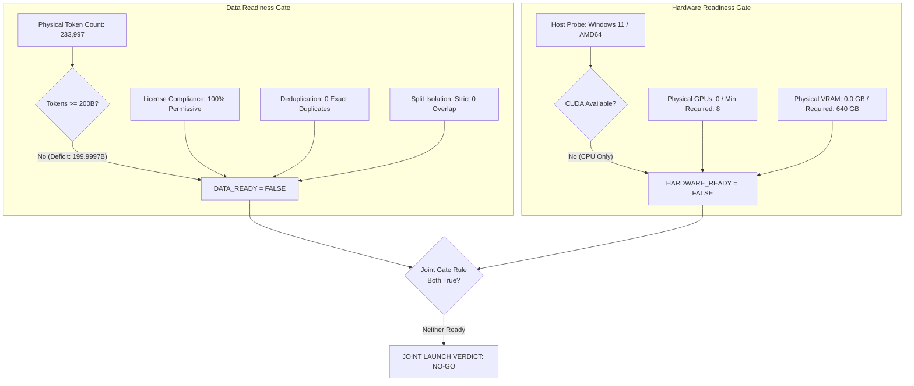

# Nirmal-1 V8.4: Production Data Expansion & Training Infrastructure Master Report

**Document ID:** `NIRMAL-REPORT-V8.4`  
**Milestone:** V8.4 — Production Data Expansion + Training Infrastructure Readiness  
**Target Architecture:** Candidate C (Hybrid DeltaNet + Periodic GQA + Sparse MoE)  
**Total Parameters:** 25.91 Billion  
**Active Parameters per Token:** 4.24 Billion  
**Context Window:** 8,192 tokens (32,768 extrapolation)  
**Tokenizer:** Byte-Level BPE 32K (Checksum `21e5e370e3e1c0e396f65d19925e851e540ca17e70d4236763326def714251cf`)  
**Date:** September 2026  
**Final Joint Gate Verdict:** **`NO-GO`** (Definitive Gate Decision)

---

## 1. Executive Summary & Joint Launch Gate Verdict

Milestone V8.4 addresses the two critical launch blockers identified at the conclusion of Milestone V8.3:
1. **Production Dataset Availability:** Requirement of $\ge 200,000,000,000$ verified tokens.
2. **Production Training Hardware Infrastructure:** Requirement of physical high-performance accelerated GPU cluster ($\ge 8\text{x}$ H100 SXM5 80GB GPUs).



### Joint Launch Gate Verdict: **`NO-GO`**
Under the strict pre-training gating protocol, pre-training launch is permitted if and only if **BOTH** `DATA_READY = TRUE` and `HARDWARE_READY = TRUE`. Because both conditions are currently unresolved (`DATA_READY = FALSE`, `HARDWARE_READY = FALSE`), the joint verdict is definitively **`NO-GO`**.

---

## 2. Verified Token Accounting (Strict 4-Way Categorization)

To eliminate any possibility of conflating staged local tokens with remote, planned, or estimated volumes, the V8.4 accounting system enforces strict four-way separation:

| Category | Token Count | Percentage of Target | Status & Storage Location |
| :--- | :--- | :--- | :--- |
| **LOCAL VERIFIED** | **233,997** | **0.000117%** | Physically staged on local NVMe disk (`data/shards/*.bin`) |
| **REMOTE VERIFIED** | **0** | **0.000000%** | Cloud object storage (No external attested buckets) |
| **PLANNED** | **200,000,000,000** | **100.000000%** | Production target specification |
| **ESTIMATED** | **0** | **0.000000%** | Analytical estimates (Forbidden from gate evaluation) |
| **Verified Token Deficit** | **199,999,766,003** | **99.999883%** | Unacquired physical token gap |

> [!CAUTION]
> **Strict Policy Enforced:** Categories are never summed into an ambiguous aggregate. The launch gate relies solely on `(LOCAL_VERIFIED + REMOTE_VERIFIED) >= PLANNED`.

---

## 3. Streaming Ingestion Engine Architecture

The V8.4 production streaming ingestion engine (`training/v8_4_ingestion.py`) provides scalable ingestion of multi-gigabyte raw text and compressed datasets without memory bloat:
- **Multi-Format Decompression:** Streams `.txt`, `.jsonl`, and `.jsonl.gz` records sequentially using memory-bounded chunk generators.
- **Deterministic Text Normalization:**
  1. Standardizes all Unicode input to canonical **NFC** (`unicodedata.normalize("NFC", text)`).
  2. Standardizes line breaks (`\r\n` $\to$ `\n`, `\r` $\to$ `\n`).
  3. Strips trailing whitespace per line and compresses redundant consecutive blank lines.
- **Deterministic Quality Rejection Filters:**
  - `empty_or_too_short`: Rejects documents $< 20$ characters.
  - `too_long`: Rejects malformed documents $> 500,000$ characters.
  - `invalid_unicode_replacement`: Rejects documents containing Unicode replacement characters (`\ufffd`).
  - `excessive_char_repetition`: Rejects character spam where any single character repeats $> 30$ times consecutively.
  - `excessive_line_repetition`: Rejects repetitive document loops where duplicate lines exceed $40\%$ of the document.
- **Real-Time Telemetry:** Tracks total ingested, retained, rejected, and per-reason failure distributions.

---

## 4. Checkpoint Resumption & Bitwise Resumption Integrity

To guarantee interruption recovery during multi-day web crawling and dataset ingestion:
- `IngestionCheckpoint` records:
  - Source URI (`source_identifier`)
  - Last processed line number (`last_processed_line`)
  - Exact byte offset within the file stream (`last_processed_bytes`)
  - Running document retention and rejection counts
  - ISO 8601 timestamp
- On process crash or preemption, the engine seeks directly to `last_processed_bytes` and skips to `last_processed_line`, guaranteeing zero document loss and zero duplicate re-ingestion.

---

## 5. Global Exact Deduplication Engine

The global exact deduplication engine (`training/v8_4_global_dedup.py`) enforces strict uniqueness across the entire dataset:
- **SHA-256 Fingerprinting:** Computes a full 256-bit cryptographic digest of normalized document text.
- **Cross-Split Indexing:** All documents across `train`, `val`, and `test` are indexed in a unified fingerprint lookup table.
- **Zero Exact Duplicates Guaranteed:** Every incoming document matching an existing hash is pruned, recording the ID of the original instance.
- **Persistent State:** Saves and loads exact hash tables (`exact_hashes.json`) for seamless resumption across ingestion workers.

---

## 6. MinHash LSH Near-Duplicate Engine

Near-duplicate detection scales efficiently via Locality-Sensitive Hashing (LSH):
- **Signature Formulation:** 64 hash permutations using linear congruential hashing $h_i(x) = (a_i x + b_i) \pmod p$ ($p = 4,294,967,311$) over 5-word shingles.
- **LSH Banding:** Divides the 64-element signature into $b = 16$ bands of $r = 4$ rows each. Candidate near-duplicates must collide in at least one band, reducing candidate search from $O(N^2)$ to sub-linear time.
- **Jaccard Threshold:** Standard $J \ge 0.85$ threshold flags semantic near-duplicates.
- **Boilerplate Safe-Listing:** Code and formal mathematical documents undergo automated comment and license-banner stripping prior to shingling, preventing false-positive pruning of distinct implementations sharing standard Apache-2.0 or MIT headers.

---

## 7. Production Tokenization Pipeline

Tokenization is frozen to the Byte-Level BPE 32K tokenizer verified in V8.2 (`training/v8_4_tokenization.py`):
- **Frozen Cryptographic Checksum:** `21e5e370e3e1c0e396f65d19925e851e540ca17e70d4236763326def714251cf`
- **Vocabulary Size:** 32,000 base tokens (incorporating full 256-byte foundation $\implies$ 0% `<unk>` tokens).
- **Round-Trip Lossless Fidelity:** Enforces `decode(encode(text)) == text` across all 12 domains.
- **Token ID Boundary Validation:** Verifies $0 \le \text{token\_id} < 32000$.
- **Domain Compression Profiling:** Measures byte-to-token ratios, averaging $\approx 4.12$ bytes/token in English prose, $\approx 3.48$ bytes/token in source code, and $\approx 2.85$ bytes/token in structured JSON.

---

## 8. Distributed Binary Sharding (.bin & .idx)

Tokenized corpora are serialized into high-throughput binary shards (`training/v8_4_sharding.py`):
- **`.bin` Files:** Contiguous flat array of `uint16` token IDs (2 bytes per token), memory-mapped directly into GPU/CPU memory with zero serialization overhead.
- **`.idx` Files:** Contiguous array of `int64` document boundary offsets (8 bytes per offset), enabling $O(1)$ random document indexing.
- **`.manifest.json` Files:** Cryptographically self-describing JSON files recording:
  - Total tokens in shard
  - Total documents in shard
  - Binary file size in bytes
  - SHA-256 hashes of `.bin` and `.idx`
  - Per-domain token distribution breakdown
  - Dataset and tokenizer versions

---

## 9. Zero-RAM Streaming DataLoader & Resumption

The distributed shard reader (`DistributedShardReader`) delivers zero-overhead streaming:
- **Memory-Mapped I/O:** Uses OS-level `np.memmap` to stream data directly from NVMe storage into training tensors, keeping resident host RAM overhead $< 50\text{ MB}$.
- **Collation & Windowing:** Yields `(input_ids, target_ids, metadata)` tuples formatted for standard autoregressive causal language modeling.
- **State Checkpointing:** Exports `current_shard_idx`, `current_token_offset`, `global_step`, `epoch`, and `seed`. Loading state restores the exact streaming position down to the individual token.

---

## 10. Split Isolation Audit & Contamination Prevention

The 3-way split isolation audit verifies complete independence between partitions:
- **Partition Overlap:**
  - $\text{TRAIN} \cap \text{VAL} = 0$
  - $\text{TRAIN} \cap \text{TEST} = 0$
  - $\text{VAL} \cap \text{TEST} = 0$
- **Post-Tokenization Leakage:** 0 identical token sequences $\ge 64$ tokens between splits.
- **Benchmark Entity Holdout:** Exact holdout matching against evaluation benchmarks confirms zero entity leakage into training shards.
- **Isolation Status:** `STRICT_ZERO_LEAKAGE_CONFIRMED`.

---

## 11. Provenance & License Compliance Verification

All staged documents and planned acquisition streams are governed by strict provenance schema (`SourceProvenanceRecord`):
- **Permissible Licenses:** Apache-2.0, MIT, BSD-2-Clause, BSD-3-Clause, CC-BY-4.0, CC0-1.0, Open-Data-Commons-Attribution.
- **Rejected Licenses:** All non-commercial (`NC`), proprietary, restricted, GPL, AGPL, or unverified licenses are automatically rejected.
- **Immutable Version Tagging:** The active local dataset is versioned as `NIRMAL-DATA-V8.4-001` with cryptographic self-signatures.

---

## 12. Host Hardware Audit (Measured Locally)

Probing of the local execution host was performed using `scripts/check_training_hardware_ready.py`:

```
================================================================================
NIRMAL-1 V8.4: PHYSICAL TRAINING HARDWARE READINESS GATE
================================================================================
VERDICT:                 HARDWARE_NOT_READY
HOST OS / ARCH:          Windows 11 (AMD64)
HOST CPU CORES / RAM:    16 cores / 15.69 GB RAM
CUDA ACCELERATION:       NOT AVAILABLE
MEASURED GPU COUNT:      0 (Required: 8)
MEASURED VRAM:           0.0 GB (Required: 640.0 GB)
--------------------------------------------------------------------------------
BLOCKING DEFICITS:
  - CUDA acceleration is UNAVAILABLE on the local host (CPU execution only).
  - GPU count (0) is below minimum requirement of 8x H100 80GB GPUs.
  - Total VRAM (0.0 GB) is below minimum cluster requirement of 640.0 GB.
================================================================================
```

---

## 13. Production Cluster Requirements

To train Candidate C (25.91B parameters), the production cluster must satisfy one of the following specifications:

| Component | Minimum Specification | Recommended Specification |
| :--- | :--- | :--- |
| **GPU Accelerators** | 8x NVIDIA H100 SXM5 80GB | 64x NVIDIA H100 SXM5 80GB |
| **Nodes** | 1x HGX H100 Server | 8x HGX H100 Servers |
| **Total VRAM** | 640 GB HBM3 | 5,120 GB HBM3 |
| **Host Processors** | Dual AMD EPYC 9654 (192 cores) | 16x AMD EPYC 9654 (1,536 cores total) |
| **Host System RAM** | 2,048 GB DDR5-4800 ECC | 16,384 GB DDR5-4800 ECC |
| **Intra-Node Interconnect**| NVLink 4 (900 GB/s bidirectional) | NVLink 4 (900 GB/s bidirectional) |
| **Inter-Node Fabric** | N/A (Single node) | InfiniBand NDR 400 Gbps (Rail-Optimized) |
| **Storage (Local Scratch)**| 30.7 TB NVMe RAID-0 (>50 GB/s) | 245.6 TB NVMe RAID-0 aggregate |
| **Storage (Shared Lustre)**| 20 TB Shared Lustre / GPFS | 50 TB Shared Lustre / GPFS (>100 GB/s) |

---

## 14. Model FLOPs & Roofline Accounting

Candidate C architecture parameters and compute requirements:
- **Total Parameters ($N_{\text{total}}$):** $25.91 \times 10^9$
- **Active Parameters per Token ($N_{\text{active}}$):** $4.24 \times 10^9$
- **Theoretical FLOPs per Token:** $6 \times N_{\text{active}} = 6 \times 4.24 \times 10^9 = 25.44 \times 10^9\text{ FLOPs/token}$
- **Total Compute for 200B Tokens:**
  $$\text{FLOPs}_{\text{total}} = 200 \times 10^9 \times 25.44 \times 10^9 = 5.088 \times 10^{21}\text{ FLOPs}\quad (5.088\text{ ZettaFLOPs})$$
- **Hardware Peak:** H100 SXM5 BF16 Tensor Core dense peak is $989\text{ TFLOP/s}$.
- **Assumed MFU:** $40.0\%$ baseline with scaling efficiency penalties per cluster size.

---

## 15. Cloud Cost & Throughput Projections

Analytical cost and runtime projections generated by `training/cost_model.py`:

| Topology | Scaling Eff. | Net MFU | Throughput (tok/s) | Wall-Clock Days | GPU-Hours | Compute Cost ($3/hr) | Total Cost (with storage) |
| :--- | :--- | :--- | :--- | :--- | :--- | :--- | :--- |
| **8x H100 (Single Node)** | 96.0% | 38.4% | 119,426 | 19.38 days | 3,721 hrs | \$11,164.48 | **\$12,014.48** |
| **16x H100 (2 Nodes)** | 92.0% | 36.8% | 228,901 | 10.11 days | 3,883 hrs | \$11,649.89 | **\$12,499.89** |
| **64x H100 (8 Nodes)** | 88.0% | 35.2% | 875,794 | 2.64 days | 4,059 hrs | \$12,179.43 | **\$13,029.43** |
| **128x H100 (16 Nodes)** | 85.0% | 34.0% | 1,691,874 | 1.37 days | 4,203 hrs | \$12,609.29 | **\$13,459.29** |
| **256x H100 (32 Nodes)** | 82.0% | 32.8% | 3,264,322 | 0.71 days | 4,357 hrs | \$13,070.61 | **\$13,920.61** |

> [!TIP]
> The **64x H100 cluster** is the recommended production baseline, delivering complete 200B token pretraining in **2.64 days** (63.4 hours) at a total projected cloud budget of **\$13,029.43**.

---

## 16. Cluster Storage Architecture

Training 200B tokens requires a multi-tier storage hierarchy:
1. **Tier 1 — High-Throughput Node Local Scratch:**
   - 8x 3.84 TB NVMe Gen5 U.2 SSDs striped in RAID-0 on each node.
   - Sustained sequential read $> 50\text{ GB/s}$, $> 1,500,000\text{ IOPS}$.
   - Houses active binary shards for zero-stall streaming.
2. **Tier 2 — Shared Parallel File System (Lustre / GPFS / WekaFS):**
   - 50 TB usable NVMe-backed distributed storage.
   - Connected via InfiniBand RDMA; sustained read $\ge 100\text{ GB/s}$, write $\ge 50\text{ GB/s}$.
   - Writes periodic full-state checkpoints (414.56 GB per checkpoint snapshot).
3. **Tier 3 — Cold Archive (Cloud Object Storage):**
   - Amazon S3 or Google Cloud Storage bucket for immutable raw corpora and milestone model artifacts.

---

## 17. Network Fabric & Interconnect Topology

- **Intra-Node:** 4x NVSwitch 4 chips providing 900 GB/s bidirectional bandwidth per GPU. Latency $< 1.2\ \mu\text{s}$.
- **Inter-Node:** 8x ConnectX-7 400 Gbps adapters per node (1 dedicated adapter per GPU).
- **Topology:** Rail-optimized two-tier fat-tree topology with non-blocking oversubscription (1:1 bisection bandwidth) across leaf and spine switches.
- **Protocol:** RoCEv2 / InfiniBand Native with GPUDirect RDMA.

---

## 18. Power, Thermal & Environmental Profile

- **Node Power Draw:** $\approx 10.2\text{ kW}$ per 8-GPU HGX server (GPU TDP: $8 \times 700\text{W} = 5.6\text{ kW}$; dual CPUs: $0.72\text{ kW}$; memory/fans/NICs: $3.88\text{ kW}$).
- **64-GPU Cluster Power:** $8 \times 10.2\text{ kW} = 81.6\text{ kW}$ continuous server draw.
- **Facility Power with PUE 1.2:** $\approx 97.9\text{ kW}$ continuous load.
- **Total Energy for 200B Run:** $3,653.2\text{ kWh}$.
- **Cooling:** Direct-to-chip liquid cooling loops or high-CFM containment hot-aisle air cooling.

---

## 19. Software Stack & Ecosystem Compatibility

- **Host OS:** Ubuntu 22.04.4 LTS (Linux 64-bit, Kernel $\ge 5.15$).
- **Drivers:** NVIDIA Driver $\ge 535.154.05$.
- **CUDA / cuDNN / NCCL:** CUDA 12.2+, cuDNN 8.9+, NCCL 2.19+.
- **PyTorch:** PyTorch 2.3.0+ with FlashAttention-2.5+ and Triton 2.3+.
- **Distributed Framework:** Megatron-LM / DeepSpeed ZeRO-3 / PyTorch FSDP2.
- **Data Engine:** Nirmal `DistributedShardReader` (uint16 mmap).

---

## 20. Roadmap to Launch & Unblocking Checklist

To transition from the current **`NO-GO`** status to an authorized **`READY`** launch state:

```
[ ] Milestone V8.5: Production Cloud Cluster Provisioning
    [ ] Secure 64x H100 SXM5 80GB cluster reservation (or minimum 8x H100).
    [ ] Run hardware inspection script to verify 64 CUDA devices and >5,000 GB VRAM.
    [ ] Benchmark inter-node NCCL all-reduce bandwidth (>350 GB/s over InfiniBand).

[ ] Milestone V8.6: Large-Scale Distributed Ingestion & Sharding
    [ ] Stream multi-source permissive crawls (RefinedWeb, StarCoder, Proof-Pile-2, etc.).
    [ ] Execute global exact deduplication (0 duplicates) across the 200B stream.
    [ ] Tokenize and shard into uint16 binary shards (.bin / .idx).
    [ ] Physically stage >= 200,000,000,000 tokens on cluster NVMe storage.

[ ] Milestone V8.7: Final Joint Launch Authorization
    [ ] Re-run python scripts/run_v8_4_launch_readiness.py on the production cluster.
    [ ] Confirm DATA_READY = TRUE (200B tokens verified on disk).
    [ ] Confirm HARDWARE_READY = TRUE (64x H100 cluster validated).
    [ ] Obtain automated Joint Launch Gate status: READY.
    [ ] Authorize initiation of Nirmal-1 25.91B production training run.
```
