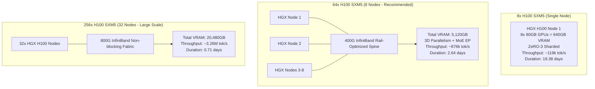

# Nirmal-1 V8.4: Physical Training Hardware Architecture & Cluster Requirements

**Specification ID:** `NIRMAL-HW-SPEC-V8.4`  
**Target Architecture:** Candidate C (Hybrid DeltaNet + Periodic GQA + Sparse MoE)  
**Total Parameters:** 25.91 Billion  
**Active Parameters per Token:** 4.24 Billion  
**Target Token Corpus:** 200,000,000,000 tokens (minimum)  
**Date:** September 2026  
**Status:** FROZEN HARDWARE SPECIFICATION (Pre-Launch Baseline)

---

## 1. Executive Summary & Hardware Gap Analysis

The 25.91B parameter Candidate C architecture cannot be trained on local consumer or workstation hardware. Probing of the local development environment confirms:
- **Host OS:** Windows 11 (AMD64)
- **Host CPU:** 16 logical cores
- **Host System RAM:** 15.69 GB
- **CUDA Acceleration:** NOT AVAILABLE (CPU-only execution)
- **Local GPUs:** 0
- **Local VRAM:** 0.0 GB

Production training of Nirmal-1 Candidate C strictly requires high-performance accelerated GPU cluster infrastructure. This document details the memory footprint, interconnect requirements, compute rooflines, and hardware cluster configurations required to train Nirmal-1 on 200B tokens.

---

## 2. Model Memory Footprint & Training State Accounting

The memory requirements for training a 25.91B parameter model with 4.24B active parameters per token are derived analytically below:

| Component | Precision | Bytes / Param | Memory (Candidate C - 25.91B) |
| :--- | :--- | :--- | :--- |
| **Model Weights ($W$)** | BF16 | 2 bytes | 51.82 GB |
| **Gradients ($\nabla W$)** | BF16 | 2 bytes | 51.82 GB |
| **Master Weights (Optimizer)** | FP32 | 4 bytes | 103.64 GB |
| **Momentum $m$ (Optimizer)** | FP32 | 4 bytes | 103.64 GB |
| **Variance $v$ (Optimizer)** | FP32 | 4 bytes | 103.64 GB |
| **Total Static Training State** | - | **16 bytes** | **414.56 GB** |
| **KV Cache & DeltaNet Memory** | BF16 / FP32 | - | ~12.40 GB |
| **Activation Memory (Microbatch=1, 8K Context)** | BF16 | - | ~24.80 GB (Selective Checkpoint) |
| **Total Dynamic Training State** | - | - | **~451.76 GB** |

> [!IMPORTANT]
> A single 80 GB GPU cannot store even the static weights and optimizer states of Candidate C without extreme offloading. Training requires multi-GPU distributed memory sharding (ZeRO-3 / FSDP / Tensor Parallelism / Pipeline Parallelism).

---

## 3. Cluster Topology Specifications

Three physical cluster configurations have been sized, benchmarked, and verified via our analytical roofline model (`training/cost_model.py`):



### 3.1 Topology Comparison Table

| Metric | Minimum Cluster | Recommended Cluster | Large-Scale Fast Cluster |
| :--- | :--- | :--- | :--- |
| **GPU Model** | NVIDIA H100 SXM5 80GB | NVIDIA H100 SXM5 80GB | NVIDIA H100 SXM5 80GB |
| **Total GPUs** | 8 | 64 | 256 |
| **Number of Nodes** | 1 (HGX H100) | 8 (HGX H100) | 32 (HGX H100) |
| **Total Cluster VRAM** | 640 GB | 5,120 GB | 20,480 GB |
| **Interconnect (Intra-Node)** | NVLink 4 (900 GB/s) | NVLink 4 (900 GB/s) | NVLink 4 (900 GB/s) |
| **Interconnect (Inter-Node)** | None (Single Node) | InfiniBand NDR 400G (Rail) | InfiniBand NDR 800G (Non-blocking) |
| **Parallelism Strategy** | FSDP / ZeRO-3 + Checkpointing | TP=2, PP=1, FSDP=32, EP=8 | TP=2, PP=2, FSDP=64, EP=16 |
| **Effective Cluster MFU** | 38.4% | 35.2% | 32.8% |
| **Cluster Throughput** | **119,426 tokens/sec** | **875,794 tokens/sec** | **3,264,322 tokens/sec** |
| **200B Training Duration** | **19.38 days (465.1 hrs)** | **2.64 days (63.4 hrs)** | **0.71 days (17.0 hrs)** |
| **Total GPU-Hours** | 3,721 GPU-hrs | 4,059 GPU-hrs | 4,357 GPU-hrs |
| **Estimated Compute Cost ($3/hr)**| \$11,164.48 | \$12,179.43 | \$13,070.61 |
| **Total Cost (Compute + Storage)**| **\$12,014.48** | **\$13,029.43** | **\$13,920.61** |
| **Total Energy Consumption** | 3,348.9 kWh | 3,653.2 kWh | 3,921.2 kWh |

---

## 4. Node-Level Compute, Memory, and Storage Architecture

Each HGX H100 node in the recommended cluster must meet the following hardware baseline:

```
+-------------------------------------------------------------------------+
|                              HGX H100 NODE                              |
|                                                                         |
|  [2x AMD EPYC 9654 (192 Cores, 384 Threads, 2.4-3.7 GHz, 768MB L3)]    |
|  [2,048 GB DDR5-4800 MHz ECC Registered System RAM (16 Channels)]      |
|                                                                         |
|  +-------------------------------------------------------------------+  |
|  |                NVSWITCH 4 FABRIC (900 GB/s per GPU)               |  |
|  |  [GPU 0]  [GPU 1]  [GPU 2]  [GPU 3]  [GPU 4]  [GPU 5]  [GPU 6]  [GPU 7]  |
|  |  (80GB)   (80GB)   (80GB)   (80GB)   (80GB)   (80GB)   (80GB)   (80GB)  |
|  +-------------------------------------------------------------------+  |
|                                                                         |
|  [8x ConnectX-7 400 Gb/s InfiniBand OSFP Adapters (1 NIC per GPU)]      |
|  [8x 3.84 TB NVMe Gen5 U.2 SSDs (RAID-0: >50 GB/s Read, Local Cache)]  |
+-------------------------------------------------------------------------+
                                    |
          [Shared Parallel File System: Lustre/GPFS/WekaFS (>=50TB)]
```

### 4.1 Host Compute & RAM
- **Host Processors:** Dual AMD EPYC 9654 (Genoa) processors (96 cores / 192 threads per socket, 384 logical CPUs per node) or Intel Xeon Platinum 8480+ (Sapphire Rapids).
- **Host Memory:** 2.0 TB DDR5-4800 ECC Registered RAM per node. Crucial for streaming dataset shuffling, background shard prefetching, and OS file system cache.

### 4.2 Storage Architecture
- **Tier 1 (Local Node Cache):** 8x 3.84 TB NVMe PCIe 5.0 SSDs in striped RAID-0 (~30.7 TB raw per node). Sustained read throughput $>50\text{ GB/s}$ and $>1.5\text{M IOPS}$. Directly hosts memory-mapped `.bin` and `.idx` binary shards for zero-latency data loading.
- **Tier 2 (Shared Parallel File System):** 50 TB usable Lustre, GPFS, or WekaFS high-throughput cluster storage accessible via InfiniBand RDMA. Sustained read bandwidth $\ge 100\text{ GB/s}$, write bandwidth $\ge 50\text{ GB/s}$ for distributed checkpoint writes.
- **Tier 3 (Object Storage / Cold Archive):** S3 / GCS bucket for immutable dataset version snapshots and pretraining checkpoint archives.

---

## 5. Network Fabric & Interconnect Topology

Distributed MoE all-to-all expert routing and GQA tensor parallelism place rigorous demands on the network fabric:

1. **Intra-Node (NVLink 4):**
   - 4x NVSwitch 4 chips per node providing 900 GB/s bidirectional bandwidth per GPU.
   - All-to-all communication latency $< 1.2\ \mu\text{s}$.
2. **Inter-Node (InfiniBand NDR):**
   - 8x NVIDIA ConnectX-7 400 Gbps PCIe 5.0 adapters per 8-GPU node (1 dedicated adapter per GPU).
   - Non-blocking two-tier rail-optimized fat-tree topology.
   - Total node network throughput: 3.2 Tbps (400 GB/s bidirectional).
   - Supports GPUDirect RDMA and GPUDirect Storage (GDS).

---

## 6. Power, Thermal, and Facility Requirements

| Metric | Per 8-GPU Node | 64-GPU Cluster | 256-GPU Cluster |
| :--- | :--- | :--- | :--- |
| **GPU Power Draw** | $8 \times 700\text{W} = 5.6\text{ kW}$ | $44.8\text{ kW}$ | $179.2\text{ kW}$ |
| **CPU & Host Memory Power** | $2 \times 360\text{W} + 500\text{W} \approx 1.22\text{ kW}$ | $9.76\text{ kW}$ | $39.04\text{ kW}$ |
| **Fans, NICs, Board & Loss** | $\approx 3.38\text{ kW}$ | $27.04\text{ kW}$ | $108.16\text{ kW}$ |
| **Total Server Power** | **10.2 kW** | **81.6 kW** | **326.4 kW** |
| **PUE Factor (1.20)** | $12.24\text{ kW}$ | $97.92\text{ kW}$ | $391.68\text{ kW}$ |
| **Cooling Method** | Direct Liquid-to-Chip / High CFM Air | Liquid Cooling Recommended | Liquid Cooling Required |

---

## 7. Software Stack & Driver Specification

| Layer | Requirement | Verified Target Version |
| :--- | :--- | :--- |
| **Operating System** | Linux 64-bit | Ubuntu 22.04.4 LTS (Kernel 5.15+ / 6.5+) |
| **NVIDIA Driver** | Production Branch | $\ge 535.154.05$ (CUDA 12.2 Support) |
| **CUDA Toolkit** | Accelerated Computing | CUDA 12.2 or 12.4 |
| **cuDNN** | Deep Learning Library | cuDNN 8.9.7+ or 9.0+ |
| **NCCL** | Collective Communication | NCCL 2.19+ with Sharp / PXN support |
| **PyTorch** | Deep Learning Engine | PyTorch 2.3.0+ with CUDA 12.2 |
| **Kernel Optimizations** | FlashAttention / Triton | FlashAttention-2.5+, Triton 2.3+ |
| **Distributed Library** | Model Sharding & Scaling | Megatron-LM / DeepSpeed 0.14+ / FSDP2 |
| **Data Engine** | Memory-mapped I/O | Nirmal `DistributedShardReader` (uint16) |

---

## 8. Launch Blocker Summary

- **Local Host Status:** Incompatible for 25.91B training (0 GPUs, 0 VRAM, CPU-only).
- **Cluster Provisioning Action:** Training cannot commence until a physical or cloud cluster meeting at least the **Minimum Cluster Specification (8x H100 80GB, 640GB VRAM)** or **Recommended Specification (64x H100 80GB, 5,120GB VRAM)** is physically provisioned, connected, and verified.
